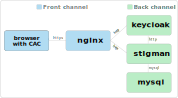

# STIG Manager with CAC Authentication

## Limitations of this example

This is an example orchestration for deploying STIG Manager with support for user authentication incorporating the U.S. Department of Defense Common Access Card (CAC). **The example is limited to connections to and from `localhost` and is NOT intended for production use.**

## General architecture



- The `nginx` reverse proxy executes a TLS stack with client certificate verification and listens on a front channel HTTPS port.
- `nginx` proxies traffic to `stigman` and `keycloak` which are listening on back channel HTTP ports.
- `stigman` communicates with `keycloak` via Keycloak's back channel port using HTTP and with `mysql` via MySQL's back channel port using the MySQL Protocol.
- End users located at `browser with CAC` connect to `nginx` on the front channel HTTPS port and request resources from `stigman` and `keycloak`. These resources include the Keycloak authentication service, the STIG Manager API, and the STIG Manager Web App.

This general architecture can be implemented with a wide range of technologies, from bare-metal deployments to complex containerized orchestrations. The example uses a simple docker-compose orchestration. 

## Dependencies for running the example

- Recent Windows, Linux, or macOS
- CAC reader configured for your OS
- docker
- docker-compose
- Chrome, Edge, or Firefox browser

The example uses a server certificate issued to the host `localhost` and signed by a CA named `demoCA`. For the example to work, you must (temporarily) import trust in your browser for the `demoCA` certificate, found at [`certs/ca/demoCA.crt`](certs/ca/demoCA.crt).

> How you do this varies across operating systems and browsers. For Windows, you import the certificate into "Trusted Root Certification Authorities". You should remove the certificate when finished running the orchestrations.

## Fetching the example files

You have two options:

- If you have `git` installed, clone this repository. Then change to the newly created directory.

- Download a ZIP of this repository using the green Code button above. Extract the archive to an appropriate directory and change to the newly extracted directory.
## Running the orchestration

```
docker-compose -p cac-example up
```

The orchestration has successfully bootstrapped when you see a `started` message like this from the STIG Manager API:

```
cac-example-stigman-1   | {"date":"2022-10-01T18:04:26.734Z","level":3,"component":"index","type":"started","data":{"durationS":21.180474449,"port":54000,"api":"/api","client":"/","documentation":"/docs"}}
```

The orchestration will continue to run until you type `Ctrl-C` to end it.

## Authenticating to STIG Manager with CAC

Once STIG Manager has started, navigate your browser to:

```
https://localhost/stigman/
```

- After a successful authentication, Keycloak attempts to match your certificate's Common Name (CN) to a Keycloak account. If necessary, it creates a new account using your CN with the roles "Application Management" and "Create Collection".
- The Web App finishes loading and makes requests to the API using an OAuth2 token issued by Keycloak on your behalf.

You can access the Keycloak admin pages by navigating to:

```
https://localhost/kc/admin
```

> After using Chrome to HTTPS connect to `https://localhost`, you may find Chrome will no longer make HTTP connections to `http://localhost:[ANY_PORT]`. Once you're finished with the example, see [this note](#to-clear-chrome-hsts-entry-for-localhost-perhaps) for how to remedy this.

## `nginx` configuration

`nginx` provides TLS service for the STIG Manager API and Keycloak. Client certificate authentication is **required** for access to the Keycloak `authorization_endpoint`. Client certificate authentication is **optional** for API endpoints because access to the API is controlled by OIDC/OAuth2 tokens.

You can [review the file `nginx/nginx.conf`](nginx/nginx.conf) for details.

## Keycloak configuration
### Keycloak Authentication Flow

During startup, Keycloak imports a [realm configuration file](kc/stigman_realm.json) which includes the `X.509 Browser` Authentication Flow to support X.509 certificate mapping. [This Keycloak documentation](https://www.keycloak.org/docs/latest/server_admin/#_x509) describes how to configure authentication flows to include X.509 client certificates.


The example uses a custom provider [modified from this project](https://github.com/lscorcia/keycloak-cns-authenticator/) that extends the built-in X.509 authenticator. The custom provider will create a new user account if a certificate cannot be mapped to an existing account. The provider file is `kc/create-x509-user.jar` which is mounted to the Keycloak container at `/opt/keycloak/providers`.

### Keycloak keystores

Keycloak requires a keystore that contains certificates for the DoD Root CA and Intermediate CAs used to sign CAC certificates. 

> The example provides the file `certs/dod/Certificates_PKCS7_v5.9_DoD.pem.p12` for this purpose, which is mounted to the Keycloak container at `/tmp/truststore.p12`

## Notes
### To clear Chrome HSTS entry (for localhost, perhaps)

`chrome://net-internals/#hsts` -  Delete domain security policies

`chrome://settings/clearBrowserData` - Cached images and files

